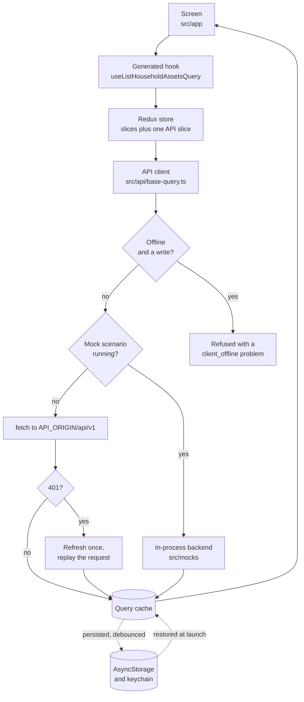

# Architecture

## How a screen reaches the API



Three things are worth taking from that picture. The screen never knows which transport
answered it, which is why the mock exercises real behaviour rather than a shortcut. Writes
are refused while offline in the client rather than in each screen, so every screen reports
it identically. And the cache is restored from disk at launch, which is what makes the app
usable with no signal.

## Layers

**Screens** under `src/app` are routes. They fetch through generated hooks, render, and
own no business logic worth testing on its own.

**Features** under `src/features` own a domain: its slice, its derived logic, its
components. Anything a screen would otherwise compute inline and get wrong twice lives
here, such as the telemetry windowing and the alert ordering.

**The API client** under `src/api` is generated from the contract, plus a base query that
attaches the token, refreshes it, refuses offline writes and can be swapped for fixtures.

**The design system** under `src/design-system` holds tokens, themes and primitives.
Screens name semantic roles, never colours.

**Storage** under `src/storage` is the only code that writes to the device.

## State

One Redux store. Client state lives in slices under `src/features`; server state belongs
to the single RTK Query API slice, which features extend with `injectEndpoints`, so no
file grows with the API surface.

| Slice           | Holds                                                 |
| --------------- | ----------------------------------------------------- |
| `auth`          | Session, and the status that gates every shell        |
| `household`     | Which household the consumer screens are looking at   |
| `viewState`     | Last dashboard range and alert filter                 |
| `recent`        | Recently opened assets and households, off by default |
| `ui`            | Theme and language preference                         |
| `network`       | Whether there is a connection                         |
| `notifications` | Push permission and this device's registration        |
| `invite`        | A pending invitation opened while signed out          |
| `cache`         | When the restored data was captured                   |
| `dev`           | Which mock scenario is running, development only      |
| `api`           | Every server response, managed by RTK Query           |

Side effects that are not requests, such as writing the session to the keychain, run in
listener middleware so reducers stay pure.

## Folder layout

```
app.config.ts        build-time config and per-variant identity
plugins/             Expo config plugins for native changes
scripts/             code generation and tooling
src/app/             expo-router routes
src/api/             API client, generated endpoints, error decoding
src/contract/        the OpenAPI document
src/design-system/   tokens, themes, primitives, toast
src/features/        one folder per domain
src/i18n/            catalogues and the typed key surface
src/lib/             formatting and pure helpers
src/mocks/           in-process backend, scenarios, generated fixtures
src/storage/         the storage facade and its registry
src/store/           store creation, typed hooks, persistence
src/test/            helpers used only by tests
e2e/                 Detox specs
docker/              the mock API stack
```

## Rendering and theming

Screens never name a colour. They name a role such as `production` or `danger`, which the
theme maps per mode, and React Navigation's theme is derived from the same source so
headers and tab bars cannot drift from the rest.

Charts run on Skia through Victory Native. The chart component draws what it is handed and
owns no fetching, no range logic and no derived figures, which is why the household view
and the per-asset view share it. See [Domain](domain.md#telemetry-logs-and-alerts-are-three-different-things) for
what a null bucket means.
