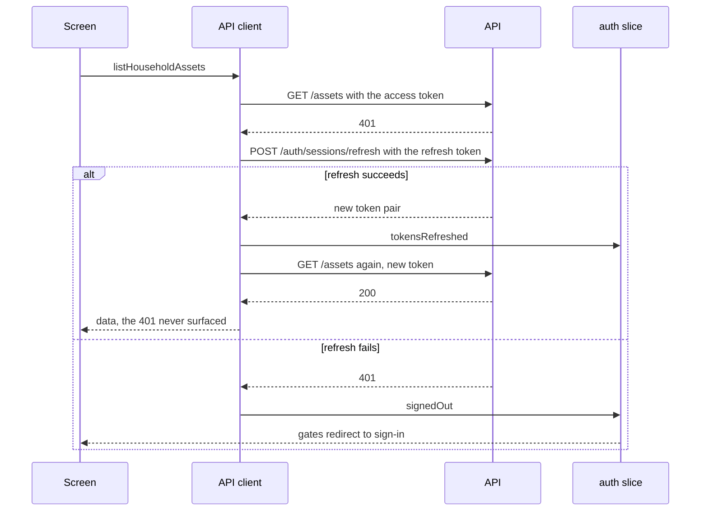

# Authentication

The session is an access token, a refresh token and the user it belongs to. It lives in
the `auth` slice while the app runs and in the device keychain between runs. It is never
written to plain storage, and a test asserts that by scanning everything plain storage
holds after a session is stored.

## A request that meets an expired token

Two details that matter more than they look. The refresh is shared: several requests
failing at once trigger one refresh and all replay after it, rather than each starting its
own and racing. And a 401 on the refresh call itself never triggers another refresh, which
would loop.

## Cold start

1. The splash screen is held.
2. Stored preferences and the cached data are read, and the session is read from the
   keychain.
3. `auth.status` moves from `restoring` to `signedIn` or `signedOut`.
4. Gates resolve and the splash is released.

Until step three, every gate renders nothing. That is what stops the app flashing the
sign-in screen at someone who is signed in, or the wrong shell at an installer.

## Sign-in

The sign-in screen validates before it sends: an invalid address never becomes a request.
On success the API returns the session, the slice stores it, listener middleware writes it
to the keychain, and the entry route sends the person to their shell, or to an invitation
if they arrived through a link.

A development build also offers a shortcut into the installer shell, because the mock
always signs in as a consumer. It is `__DEV__` only.

## Creating an account

Sign-up creates a consumer account and signs it in, so someone lands in the app rather than
back on a sign-in screen. Installers are never created this way: they arrive through an
invitation, which is why the form has no role to choose.

The form validates before it sends, including that both passwords match, so a mismatch
never becomes a request. One failure is worded by the app rather than shown as the server
sent it: an address that already has an account, because that tells the person what to do
next.

## Forgetting a password

`/forgot-password` asks for an address and always answers the same way, whether or not that
address has an account. Telling a caller which addresses exist turns the screen into a way
to enumerate accounts. The API behaves identically, so neither layer leaks it.

The link lands on `/reset-password/<token>`, reachable while signed out, which is the whole
point. It is also the one screen in the signed-out group that a signed-in person is allowed
to reach: someone can follow a reset link on a phone where they are still signed in, and
bouncing them to the dashboard would leave them unable to change the password they came to
change.

Setting a new password revokes every existing session server-side, so the app sends them to
sign in with it rather than pretending the current session is still good.

## Deleting an account

Settings offers account deletion, which both app stores require to be possible from inside
the app. It asks for the current password, because a phone left unlocked should not be two
taps from an erased account, and it says what will be deleted before the button rather than
after it.

Once the server confirms, the handset is detached from push notifications while the token
still works, and the app signs out, which clears everything stored about that person. See
[decision 0013](decisions/0013-account-deletion.md).

## Sign-out

Signing out does three things in order: it detaches this handset from push notifications
while the token still works, it clears everything on the device belonging to that person,
and it clears the session from the store, which makes every gate redirect.

What is kept is what belongs to the handset rather than the account: the theme, the
language and whether the notification prompt was dismissed. See
[Storage](storage.md#scopes).

## Roles

The role comes from the API as part of the session and decides which shell mounts. The app
hides what it knows is irrelevant to a role; it does not pretend to enforce access, which
is the server's job. See [Navigation and roles](navigation.md).

## Offline

Reads fall through to the cached data. Writes are refused with a `client_offline` problem
rather than queued, which includes signing in: there is nothing useful to do with
credentials that cannot be checked. See
[decision 0007](decisions/0007-refuse-offline-writes.md).
