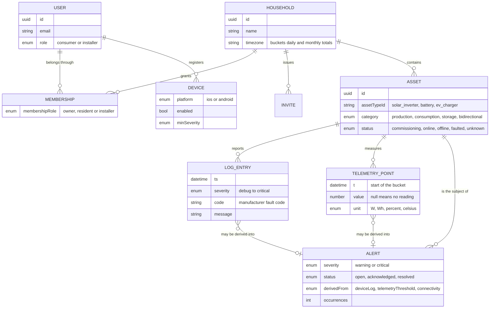

# Domain

## The model

## Telemetry, logs and alerts are three different things

This is the distinction the whole data model turns on, and the one most likely to be
collapsed by accident.

**Telemetry is measurement.** Numbers sampled on a schedule, one point per metric per
interval, always requested over a time range at some resolution. High volume, regular and
aggregatable, which is why the server downsamples a year into daily totals rather than the
app doing it. This is the only one of the three that feeds a chart.

A null value is not zero. It means the server had no reading for that bucket. The chart
draws a break and the totals skip it, because an inverter that was unreachable at noon did
not produce nothing, it produced an unknown amount.

**Logs are what the device said.** An irregular stream of text events from the asset or
the manufacturer's cloud, in the order they happened. Mostly noise, occasionally the reason
something broke. Not aggregatable, not chartable, read as a list when someone is diagnosing
one asset. Paged by cursor, because the stream is effectively endless.

**Alerts are interpretation.** A deduplicated, stateful problem that someone should act on,
derived server-side from logs, telemetry thresholds or lost contact. Two hundred repeating
log lines collapse into one alert with an occurrence count. It has a lifecycle rather than
a timestamp: open, acknowledged, resolved.

The app reads alerts and can only acknowledge or resolve them. It never decides what counts
as a fault, and there is no delete, because a resolved alert reopens by itself if the
condition returns. See [decision 0006](decisions/0006-server-derives-alerts.md).

|           | Shape                     | Query                      | Polled             | Written by the app |
| --------- | ------------------------- | -------------------------- | ------------------ | ------------------ |
| Telemetry | Series of points          | Time range plus resolution | Only the day range | No                 |
| Logs      | Cursor page, newest first | Optional severity floor    | Never              | No                 |
| Alerts    | Short list                | Status and severity        | Every 30 seconds   | Status only        |

## Assets

An asset is an energy device in a household: an inverter, a battery, a charger, a heat
pump. Its category says how it participates in the energy balance, which decides how it is
drawn and summed.

Adding one is driven by the catalogue rather than by code. A model declares the parameters
needed to reach it through its manufacturer, including which are secret and how to validate
them, and the app renders that form. Onboarding a new manufacturer therefore needs no app
release.

An asset starts as `commissioning` and becomes `online` after the first successful read. It
reads as `faulted` when it has an open critical alert, so status and alerts can never
disagree.

## Households and access

A household is the unit everything hangs off: assets, alerts, invitations. It carries a
timezone, because that is where daily and monthly totals are bucketed, and the app computes
its chart windows in it rather than in the device's zone.

Membership decides what someone sees. An owner manages access, a resident sees everything
and can add assets, an installer sees assets, logs and faults and nothing about the
household itself. The app hides what it knows is irrelevant; the server is what enforces it.

## Units

The API speaks watts for power and watt-hours for energy, with every value carrying its
unit. Timestamps are ISO 8601 in UTC. Conversion to something a person reads happens in one
module, in the active locale, so nothing can be shown in the wrong unit or with the wrong
decimal separator.
