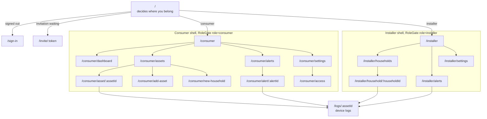

# Navigation and roles

Routes are files under `src/app`, resolved by expo-router. Paths are type-checked against
the real route table, so a misspelled destination is a compile error rather than a dead
tap. The table is generated into `.expo/types`, which is not committed, so CI runs
`npm run typegen` before typechecking.

## The route tree

## The gates

Three guards, each answering a different question.

`RoleGate` wraps a shell and asks whether you are the right role. A signed-out visitor goes
to sign-in. Someone with the wrong role is redirected to their own shell rather than shown
an error, because being an installer is not a mistake.

`RequireSession` wraps a route both roles reach, such as the device logs. It asks only
whether you are signed in.

The entry route decides where a signed-in person belongs, and sends someone who followed an
invitation link to that invitation first, rather than to their dashboard.

While the stored session is still being read, every gate renders nothing and the splash
screen stays up. No screen is allowed to render against a half-known identity.

## Why the roles are path segments

`/consumer/alerts` and `/installer/alerts` are real paths. An earlier version used route
groups, which are stripped from the URL, so both shells resolved to `/alerts` and
navigation landed on whichever matched first. See
[decision 0011](decisions/0011-path-segments-for-roles.md).

Tabs still live in a group inside each shell, so a detail screen or a modal can cover the
tabs rather than being squeezed into one.

## Deep links

The scheme is `voltique`. An invitation arrives as `voltique://invite/<token>`. Opened
while signed out, the token is held in the store, the person is sent to sign in, and the
entry route brings them back to it, so a link is never lost.

Universal and app links are not configured. That needs domain association files, which
belong with the real domain rather than with this code.

A tapped notification opens what it refers to, including when it launched the app from
cold. A consumer lands on the alert, an installer on the device log. See
[Authentication](auth.md) for how the session is known by then.

## Adding a screen

1. Add the file under the right shell, or at the root if both roles reach it.
2. Declare it on the parent `Stack` if it is not a tab.
3. Run `npm run typegen` so the path type-checks.
4. Give every interactive element a `testID`.
5. Put its copy in the catalogues, never in the component.
